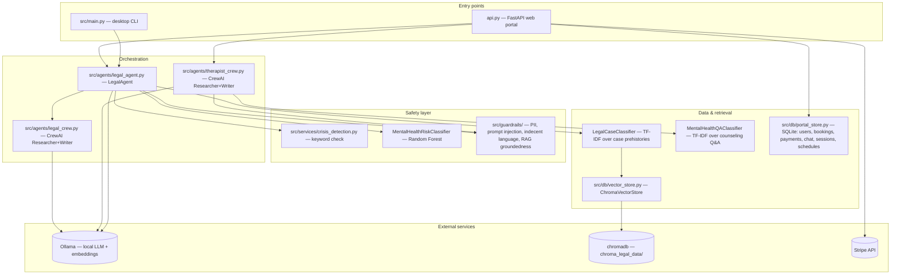

# Architecture

A map of what lives where in this repository and how a request flows through
it. For setup instructions see [START_HERE.md](START_HERE.md); for a
feature-by-feature changelog see [DOCUMENTATION.md](DOCUMENTATION.md) and
[FEATURES_ADDED.md](FEATURES_ADDED.md).

## Two entry points, one shared core

| Entry point | What it is | Run with |
|---|---|---|
| `api.py` (repo root) | FastAPI web portal: browser chat UI, REST API, WebRTC signaling | `uvicorn api:app --reload` |
| `src/main.py` | Desktop CLI: webcam + microphone loop, keyboard-driven | `python src/main.py` |

Both are thin entry points over the same underlying code in `src/` — neither
contains business logic itself, they just wire up `SystemState`, the vector
store, the classifiers, and `LegalAgent`, then expose it differently (HTTP API
vs. a terminal loop).

## Layers



- **`src/agents/legal_agent.py`** (`LegalAgent`) is the orchestrator for the
  legal side: crisis/safety checks first (Steps 0-0c: keyword match, Random
  Forest risk classifier, guardrails), then classifier match → exact vector
  match → RAG fallback via `legal_crew.py`. See the numbered `# Step` comments
  in `get_advice()` for the exact order.
- **`src/agents/legal_crew.py`** / **`therapist_crew.py`** each run a
  two-agent CrewAI crew (Researcher organizes already-retrieved context,
  Writer drafts the final answer) against the local Ollama model. Both fall
  back to older, simpler behavior if `crewai` isn't installed or a call fails.
- **`src/guardrails/`** is a separate, composable safety layer (PII detection,
  prompt-injection patterns, indecent-language filtering, RAG-citation
  groundedness) used by both the legal and therapist domains via
  `GuardrailManager(domain="legal"|"therapist")`. It complements, and never
  replaces, the crisis-detection pipeline above it.
- **`src/db/vector_store.py`** (`ChromaVectorStore`) talks to `chromadb`
  directly rather than through `langchain-chroma` — see its module docstring
  for why (a real version-pin conflict with `crewai`).
- **`src/db/portal_store.py`** is the single SQLite persistence layer for
  everything the web portal needs to survive a restart: users, bookings,
  payments, chat history, session tokens, and per-provider schedules.

## Request flow: a legal chat message

1. `POST /api/chat` (`api.py`) loads prior turns for this `session_id` from
   `portal_store.chat_messages`, appends the new user message.
2. `LegalAgent.get_advice()` runs, in order: keyword crisis check → Random
   Forest risk classifier → guardrails input check → (if short) clarification
   prompt → classifier match (deterministic, TF-IDF) → exact vector match → RAG
   fallback (CrewAI crew, using `ChromaVectorStore` + court-case CSV context).
3. Guardrails output check runs on the crew-drafted answer (PII / indecent
   language / RAG groundedness for cited case numbers) before it's returned.
4. The response is persisted to `chat_messages` and returned.

## Request flow: a therapist chat message

Same shape, different data: `POST /api/therapist-chat` runs the same
crisis-check ordering, then (if not flagged) `therapist_crew.py`'s
Researcher+Writer crew over `MentalHealthQAClassifier` (TF-IDF retrieval over
`src/data/student_mh_counseling_100k_with_label_column.csv`), then guardrails
output check, then persists and returns.

## External services this depends on

- **Ollama**, running locally, serving `nomic-embed-text` (embeddings) and
  `armenia-lawyer-router` (this project's own fine-tuned answer model). Not a
  hosted API — must be running wherever `api.py`/`src/main.py` runs.
- **chromadb** — persistent vector store on disk at `./chroma_legal_data`.
- **Stripe** — payments; no-ops cleanly without `STRIPE_SECRET_KEY` set.
- **crewai** — installed separately from `requirements.txt` (see
  `requirements.txt`'s comment block) due to a hard dependency conflict with
  the pinned `chromadb` version.

## Deployment

`Dockerfile` + `docker-compose.yml` containerize `api.py` alongside an Ollama
service (kept separate — Ollama is a large, independent model runtime, not
bundled into the app image). `src/main.py` (the desktop CLI) is not
containerized — it needs a local webcam/microphone.

A static, read-only OpenAPI reference is published from `docs/` (Swagger UI +
`docs/openapi.json`) for GitHub Pages — browsing the API shape without running
the actual backend. Regenerate after changing endpoints:

```bash
python -c "import json, api; json.dump(api.app.openapi(), open('docs/openapi.json', 'w'), indent=2)"
```
